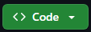

# Proyecto Final en Coder House - Python

##### Alumno: Douglas Jiménez

##### Comisión: 60090

## Nombre del Proyecto

Proyecto Final PetVet

## Descripción del Proyecto

**Pet Vet** es una aplicación web diseñada para gestionar bases de datos de mascotas, clientes, productos y sucursales. Tambien tiene una funcion en proceso para que las personas puedan realizar compras. Es ideal para veterinarias o negocios relacionados con el cuidado de mascotas que deseen administrar su información de manera eficiente. Los usuarios pueden realiar las siguientes operaciones dentro de la pagina:

##### Usuario Anonymous:

* Navergar por las pestañas "Sobre nosotros".
* Navergar por las pestañas "Sucursales".
* Ver el nombre, direccion y telefono de las sucursales.
* Buscar una sucursal especifica.
* Registrarse
* Iniciar Sesion

##### Usuario Registrado:

* Navergar por las pestañas "Sobre nosotros".
* Navergar por las pestañas "Sucursales".
* Navergar por las pestañas "Productos".
* Ver descripcion de los productos
* Comprar algun producto (Esta opcion esta en desarollo)
* Buscar algun producto en especifico.
* Podra ver su perfil de usuario
* Editar su perfil de usuario
* Cambiar su contraseña
* Enviar mensaje a  Atencion_al_Cliente y Atencion_Veterinaria
* Revisar si tiene algun mensaje y responderlo con el boton que esta en desarrollo tambien

##### Super Usuario:

* Navegar por todas las pestañas
* Crear productos, clientes, sucursales, mascotas
* Editar productos, clientes, sucursales, mascotas
* Eliminar productos, clientes, sucursales, mascotas
* Agregar descripcion a los productos
* Agregar historial de las mascotas
* Editar su perfil
* Cambiar su contraseña
* Enviar mensaje a todos los usarios
* Revisar si tiene algun mensaje y responderlo con el boton que esta en desarrollo tambien

## Tecnologías utilizadas

##### Back-End

* Python
* Django

##### Front-End

* HTML
* CSS
* Bootstrap
* JavaScript

## Pasos descargar y usarlo

1. Para descargar el repositorio [haz click aca](https://github.com/douglasdjcode/ProyectoFinalPetVet) y te llevara directamente al repositorio
2. Dirigete al boton <> **Code**

   
3. Se desplegara un Menu donde tendras que seleccionar la opcion "Download Zip"
4. Lleva ese archivo hasta el Visual Studio Code
5. Luego en la Terminar Ejecuta los comandos necesarios para instalar
6. Para Correr el servidor ejecuta en la Terminar "python manage.py runserver"
7. Abre tu navegador y accede a `http://127.0.0.1:8000`
8. Si deseas ingresar al panel de administración de Django, utiliza las siguientes credenciales:

   * **Usuario** : `dou`
   * **Contraseña** : `contraseña2`

## Funcionalidades

* Gestión de información de  **mascotas** .
* Administración de datos de  **clientes** .
* Registro de **productos** disponibles.
* informacion de **sucursales.**
* Registro de usuarios
* Mensajeria
* Compras (en desarrollo)

## Estado del proyecto

El proyecto se encuentra en desarrollo, con funcionalidades básicas implementadas.
